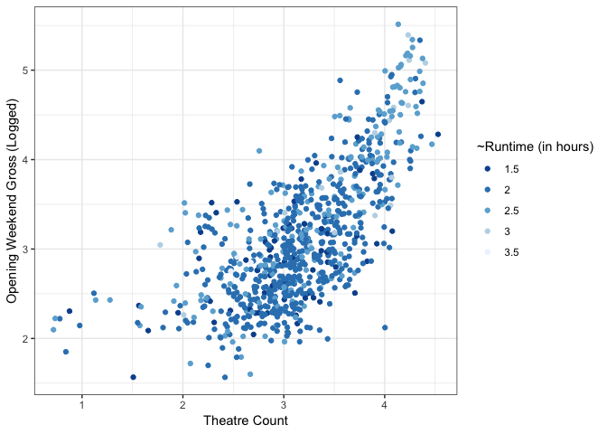
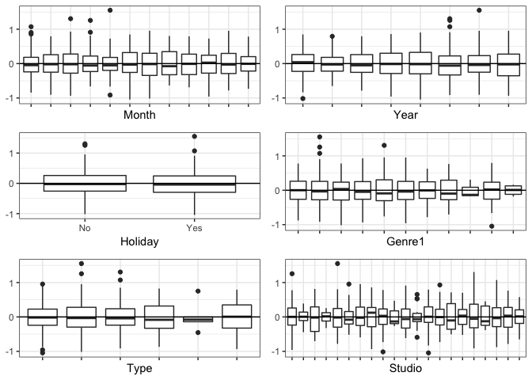
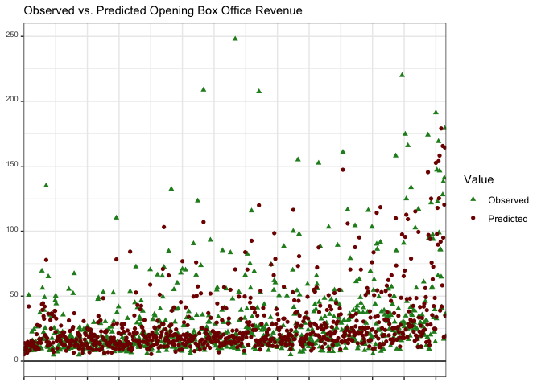
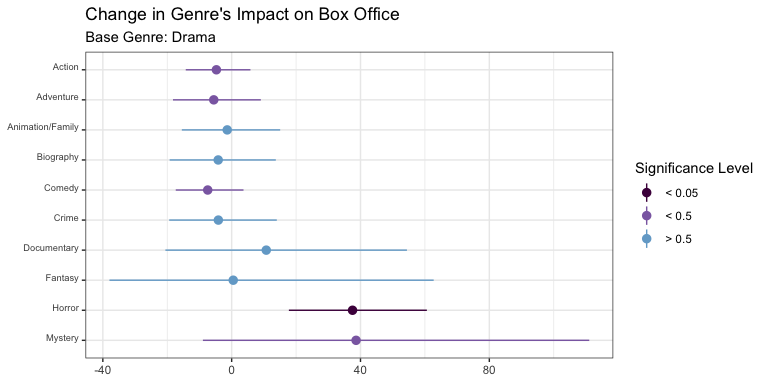
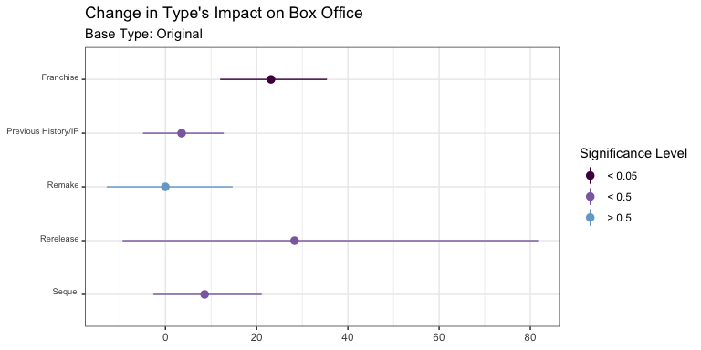
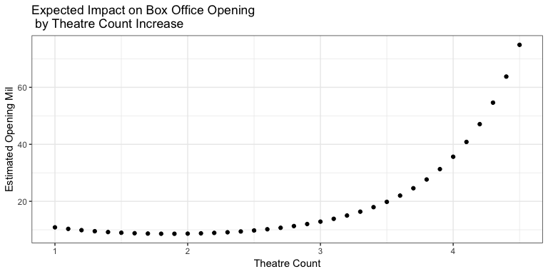
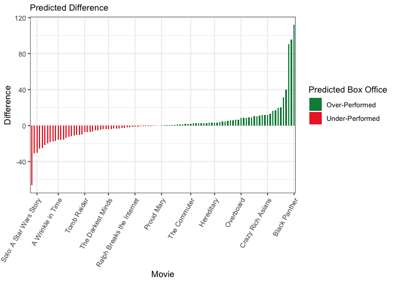
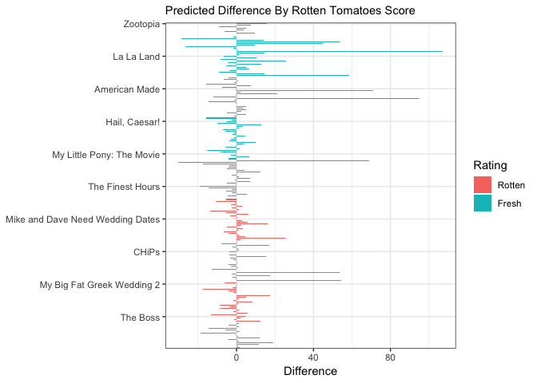

# US Weekend Box Office Predictions
*The goal of this analysis is to analyze any trends in the top 100 box office opening weekends in the current decade, and expand those trends and learnings to predict future opening weekends.*

[Full code can be found here](https://github.com/avanigupta1/Box-Office-Predictions/blob/master/Full%20Markdown%20Code), with final report below: 
 


## Section 1: Training Data Analysis and Modeling

### 1. Research Question

Can a combination of distribution, release, and marketing factors predict the opening weekend box office revenue for movies in the United States?
 

To delve into this question, an exploratory analysis was done, as opposed to a hypothesis-driven one. Additionally, the movie’s budget was not taken into consideration, as the aim of this study was to focus on what, and to what extent, aspects surrounding the perception of a movie result in the audience’s willingness to see it during it’s opening weekend. 


### 2. Data Description & Dictionary


To proceed with the analysis, variables were initially chosen based on theoretical assumptions and then tested for usability later on.
The response variable is 'Opening Mil', which is the total US opening weekend revenue of a film, in millions. Theatre count, month and year of release, runtime, and distribution studio were then added in. Additionally, the primary listed genre was taken into account, along with a self reported variable called 'type'. The aim of including type was to take into account a film's place in a wider pop cultural landscape, such as whether it was based on pre-existing intellectual property or if it was an extension of a franchise. Lastly, scores from 'The Bankability Index' were included to account for star power and how important certain stars or directors are in corralling an audience to the theatre.  


The following data has been aggregated from websites such as BoxOfficeMojo, IMDb, and The Numbers Bankability Index. 


| Variable     | Variable Description                                                           | Type        | Input               |
|--------------|--------------------------------------------------------------------------------|-------------|---------------------|
| Movie        | Movie Title                                                                    | Continuous  |                     |
| Year         | Release Year                                                                   | Categorical | 2010                |
|              |                                                                                |             | 2011                |
|              |                                                                                |             | 2012                |
|              |                                                                                |             | 2013                |
|              |                                                                                |             | 2014                |
|              |                                                                                |             | 2015                |
|              |                                                                                |             | 2016                |
|              |                                                                                |             | 2017                |
| Opening Mil  | Opening Weekend Revenue (in millions)                                          | Continuous  |                     |
| Theatre Thou | Number of Theatres Playing The Movie (in thousands)                            | Continuous  |                     |
| Month        | Month of Release                                                               | Categorical | January             |
|              |                                                                                |             | February            |
|              |                                                                                |             | March               |
|              |                                                                                |             | April               |
|              |                                                                                |             | May                 |
|              |                                                                                |             | June                |
|              |                                                                                |             | July                |
|              |                                                                                |             | August              |
|              |                                                                                |             | September           |
|              |                                                                                |             | October             |
|              |                                                                                |             | November            |
|              |                                                                                |             | December            |
| Holiday      | Movie Released in Conjunction with a Holiday Weekend                           | Binary      | 0                   |
|              |                                                                                |             | 1                   |
| Type         | Movie Position Within a Larger Pop Cultural Framework                          | Categorical | Original            |
|              |                                                                                |             | Sequel              |
|              |                                                                                |             | Remake              |
|              |                                                                                |             | Rerelease           |
|              |                                                                                |             | Franchise           |
|              |                                                                                |             | Previous IP/History |
| Genre1       | Primary Listed Genre                                                           | Categorical | Drama               |
|              |                                                                                |             | Action              |
|              |                                                                                |             | Adventure           |
|              |                                                                                |             | Animation/Family    |
|              |                                                                                |             | Biography           |
|              |                                                                                |             | Comedy              |
|              |                                                                                |             | Crime               |
|              |                                                                                |             | Documentary         |
|              |                                                                                |             | Fantasy             |
|              |                                                                                |             | Horror              |
|              |                                                                                |             | Mystery             |
| Runtime      | Length of Movie (in minutes)                                                   | Continuous  |                     |
| Studio       | Primary Distribution Studio                                                    | Categorical |                     |
| Bankability  | Cumulative Sum of ‘Star Scores’ of Director and First Four-Billed Cast-Members | Continuous  |                     |


##3. Initial Limitations

Though the analysis attempts to incorporate a variety of impactful factors, there are strong limitations present, such as:

- Small sample size and arbitrary cut off: the data only takes into account the top 100 movies of the past 8 years
- Inability to gauge the change in audience interaction with film in the last decade in regards to YouTube and social media
- Inability to incorporate social conversation, such as a sudden social media push or scandal surrounding the film
- Potential errors in self-reported variables such as ‘Type’
- Incomplete representation of all cast and crew in the sum that composes the ‘Bankability’ variable


### 4. Methods of Analysis


#### *Model Construction*

As the response variable of note is continuous, a linear model was chosen to analyze the data. 

#### *Regression Assumptions*

- **Sample Size:** While it would be more prudent to have a larger set in this sort of analysis, the analysis set consists of 800 movies. 

- **Normal Distribution:** Initially, the response data was extremely right skewed. However, after logging the variable, the distribution proved to be normal.

- **Multicollinearity Concerns:** The highest correlation between any continuous variable is ~0.7, which is on the higher end, but does not necessarily negate either variable’s use in the analysis. 


#### *Exploratory Data Analysis*

Regarding the continuous variables, there seemed to be a clear quadratic relationship between the response variable, Opening Mil(Log), and Theatre Thou, as can be seen below. 


<!-- -->


Within the categorical variables, Genre1, Type, Month, and Studio were all extremely varied across sub-categories. Additionally, many interactions seemed present, such as Genre1 and Type, however they were either hindered by under-representation of level-level relationships in the data, or were merely somewhat correlated as opposed to interactive. 


#### *Linear Modeling*

After testing out the usability of variables and potential interactions using interaction analysis and ANOVA tests, the final linear model is as follows: 

$$Log Opening Box Office _Mil = Theatre + Theatre^2 + Runtime + Bankability +$$ 
$$Release Year + Release Month + Holiday Weekend + Distribution Studio + Primary Genre + Type$$

Previously included variables, such as ‘GenreNum’, were present in the analysis. The variable served to address the fact that many films are an amalgam of genres, and was included over a secondary genre variable, as there were too many missing values in the dataset. ‘GenreNum’ was eventually removed due to seeming insignificance resulting from a nested F-test.


The final model summary is as follows: 


```
## 
## Call:
## lm(formula = logOpeningMil ~ TheatreThou + TheatreThou.2 + Runtime + 
##     Bankability + as.factor(Year) + Studio + Genre1 + Holiday + 
##     Type + Month, data = fullSet)
## 
## Residuals:
##      Min       1Q   Median       3Q      Max 
## -1.04547 -0.27554 -0.02817  0.25847  1.55165 
## 
## Coefficients:
##                           Estimate Std. Error t value Pr(>|t|)    
## (Intercept)              3.235e+00  2.973e-01  10.879  < 2e-16 ***
## TheatreThou             -1.161e+00  1.641e-01  -7.074 3.48e-12 ***
## TheatreThou.2            3.114e-01  2.855e-02  10.908  < 2e-16 ***
## Runtime                  4.841e-03  1.068e-03   4.533 6.78e-06 ***
## Bankability              6.042e-04  7.877e-05   7.671 5.39e-14 ***
## as.factor(Year)2011     -4.502e-02  5.838e-02  -0.771 0.440866    
## as.factor(Year)2012     -2.696e-02  5.897e-02  -0.457 0.647709    
## as.factor(Year)2013     -5.912e-02  6.008e-02  -0.984 0.325403    
## as.factor(Year)2014     -6.032e-02  5.944e-02  -1.015 0.310585    
## as.factor(Year)2015     -1.592e-01  5.919e-02  -2.689 0.007325 ** 
## as.factor(Year)2016     -1.999e-01  5.969e-02  -3.349 0.000853 ***
## as.factor(Year)2017     -3.524e-01  6.162e-02  -5.720 1.55e-08 ***
## StudioCBS               -4.473e-01  1.782e-01  -2.510 0.012273 *  
## StudioDisney             9.512e-02  1.618e-01   0.588 0.556705    
## StudioFocus             -3.692e-01  1.284e-01  -2.875 0.004150 ** 
## StudioFox               -2.686e-01  6.571e-02  -4.088 4.82e-05 ***
## StudioLG/S              -2.356e-01  9.773e-02  -2.411 0.016158 *  
## StudioLGF               -1.407e-01  8.278e-02  -1.700 0.089546 .  
## StudioORF               -5.320e-01  1.249e-01  -4.258 2.33e-05 ***
## StudioOther             -4.048e-01  1.004e-01  -4.031 6.13e-05 ***
## StudioP/DW              -3.738e-01  1.420e-01  -2.631 0.008678 ** 
## StudioPar.              -2.483e-01  7.196e-02  -3.450 0.000591 ***
## StudioRela.             -4.627e-01  1.115e-01  -4.151 3.69e-05 ***
## StudioSGem               7.368e-02  1.000e-01   0.737 0.461614    
## StudioSony              -2.323e-01  7.045e-02  -3.298 0.001020 ** 
## StudioSTX               -4.236e-01  1.443e-01  -2.935 0.003440 ** 
## StudioTriS              -7.690e-02  1.169e-01  -0.658 0.510741    
## StudioUni.              -1.642e-02  6.640e-02  -0.247 0.804740    
## StudioW/Dim.            -5.197e-01  1.794e-01  -2.897 0.003875 ** 
## StudioWB                -2.572e-01  6.704e-02  -3.837 0.000135 ***
## StudioWB (NL)           -1.790e-01  8.719e-02  -2.053 0.040409 *  
## StudioWein.             -2.599e-01  1.584e-01  -1.641 0.101272    
## Genre1Action            -4.856e-02  5.360e-02  -0.906 0.365212    
## Genre1Adventure         -5.721e-02  7.332e-02  -0.780 0.435459    
## Genre1Animation/Family  -1.390e-02  7.855e-02  -0.177 0.859590    
## Genre1Biography         -4.272e-02  8.722e-02  -0.490 0.624383    
## Genre1Comedy            -7.729e-02  5.777e-02  -1.338 0.181312    
## Genre1Crime             -4.222e-02  8.832e-02  -0.478 0.632756    
## Genre1Documentary        1.021e-01  1.693e-01   0.603 0.546912    
## Genre1Fantasy            4.860e-03  2.455e-01   0.020 0.984214    
## Genre1Horror             3.186e-01  7.903e-02   4.032 6.11e-05 ***
## Genre1Mystery            3.266e-01  2.140e-01   1.526 0.127416    
## HolidayYes              -8.147e-02  4.132e-02  -1.972 0.049034 *  
## TypeFranchise            2.081e-01  4.836e-02   4.303 1.91e-05 ***
## TypePrevious History/IP  3.483e-02  4.352e-02   0.800 0.423693    
## TypeRemake              -2.949e-04  7.013e-02  -0.004 0.996646    
## TypeRerelease            2.492e-01  1.773e-01   1.406 0.160192    
## TypeSequel               8.239e-02  5.558e-02   1.482 0.138648    
## MonthApril              -1.690e-01  7.651e-02  -2.209 0.027468 *  
## MonthAugust             -2.359e-01  7.363e-02  -3.203 0.001418 ** 
## MonthDecember           -3.008e-01  7.799e-02  -3.856 0.000125 ***
## MonthFebruary            6.176e-02  7.296e-02   0.846 0.397558    
## MonthJuly               -8.924e-02  7.252e-02  -1.231 0.218847    
## MonthJune                9.921e-03  7.545e-02   0.131 0.895424    
## MonthMarch              -9.077e-03  7.500e-02  -0.121 0.903697    
## MonthMay                -1.209e-01  7.876e-02  -1.535 0.125247    
## MonthNovember            2.875e-02  7.580e-02   0.379 0.704640    
## MonthOctober            -1.645e-01  7.359e-02  -2.236 0.025678 *  
## MonthSeptember          -2.166e-01  7.528e-02  -2.878 0.004119 ** 
## ---
## Signif. codes:  0 '***' 0.001 '**' 0.01 '*' 0.05 '.' 0.1 ' ' 1
## 
## Residual standard error: 0.405 on 741 degrees of freedom
## Multiple R-squared:  0.7241,	Adjusted R-squared:  0.7025 
## F-statistic: 33.53 on 58 and 741 DF,  p-value: < 2.2e-16
```

#### *Residuals & Influence Diagnostics*

When reviewing influence diagnostics such as Leverage and Cook’s Distance, the 7 outlying points were all within categories that were relatively under-represented in the data (such as Rereleases and Fantasy films). These points were not removed. 


The residuals of the final linear model were fairly well vertically-distributed, as can be seen below:  


<!-- -->


### 5. Interpretations & Takeaways

Using the linear model created above, the observed values in the 800-movie dataset were plotted against the predicted values to get a sense of fit, as seen below: 

<!-- -->

While the model resulted in 60 estimated coefficients, due to the categorical nature of much of the data, the following have been extracted to best summarize the results of the regression.

The estimated opening weekend intercept value is **$25.4 million**, with a 95% CI of \$14.17 mil to \$45.53 mil


With all else being held constant:

* Moving from a release on a non-holiday weekend to a holiday weekend estimates a **7.8% decrease** (CI: -15% to -0.03%)
This result on its surface looks incorrect, as one would assume a holiday film would appeal to a wider audience. However, the estimates are aggregated as Friday-Sunday, while holiday movies get a bulk of their audience during the non-weekend days associated with said holiday. 

* An increase of 15 minutes in a film’s runtime is estimated to constitute a **7.5%** increase in revenue (CI: 4.2% to 10.9%)
This also seems problematic, as this may make sense for films only in the lower end of the set 

* An increase in Bankability score by 100 points is estimated to lead to a **6.2%** increase in revenue (CI: 4.6% to 7.9%)

* Month and Studio both prove to be problematic, as the estimates either have large p-values or unusually large confidence intervals. 

* February, commonly known as ‘Dumpuary’ in Hollywood as many ‘bad’ movies are released, is estimated as the highest grossing month with a **6.4% increase** from the second-ranked month. This is accompanied by a large CI from -7.8% to 22.8%.  

* Disney has the highest estimate with **9.98% increase** from the base-level, with a vast CI from -19.8% to 51.%.
 
* Revenues seem to progressively decrease as the years increase, with 2017 showing an estimated **decrease of 29.7%** from 2010 CI: -37.7% to -20.66%)


* Interpretative graphs of changes in Genre, Type, and Theatre Count below:  
  
  










*****

## Section 2: Predictive Modeling for 2018

Using the linear model created in the previous section, would it be possible to predict the highest grossing films of 2018?

#### *Data Collection*


Same data methods used to obtain a test set for the year 2018, from Jan 1 to Nov 29. 

#### *Limitations* 

As 2018 was not present in the Year variable in the training set, 2017 was used in its place within the test set. 


#### *Results*

Differences (observed minus predicted) were used to analyze the model. The absolute value mean of the differences was **11.34 mil**, with a standard deviation of **18.52 mil**. Results below:


<!-- -->


#### *Takeaways*

Overperforming films such as Black Panther and Crazy Rich Asians took on social importance during the lead-up to their releases, and became box office juggernauts. That type of groundswell has not been accounted for, and would be extremely difficult to gauge in a long-range forecasting effort.

#### *Future Analysis*

As this is a very surface level analysis with an incredibly small sample size, it would be prudent to go deeper into prediction regression and modes of analysis for further inquiry. 


*****

## Section 3: The Rotten Tomatoes Effect

The film-score aggregator Rotten Tomatoes rose to prominence in 2016, and since then has been accused of being the cause of box-office failures. Is there any merit to these claims? As an off-shoot experiment of the primary analysis, Rotten Tomatoes data has been added into the dataset to analyze this argument. 


#### *Data*

Rotten Tomatoes (RT) aggregates critic and audience reviews of a movie, and sums them to construct a score out of 100. Scores > 60 are classified as “Fresh”, and < 60 are considered “Rotten”. 

For this experiment, RT scores for each movie from 2016 and 2017 were obtained from the day before or of their release.

#### *Analysis & Interpretation*

Two linear models were used to analyze this effect: using RT score as a continuous variable and using the RT classifications categorically. Both variables had significant p-values when predicting opening revenue, approximating that:

- A 1-point RT increase is estimated to result in a **0.39%** increase in revenue (95% CI: 0.11 % to 0.66%)
- Moving from Rotten to Fresh is estimated to have a **24.5%** increase in revenue (95% CI: 6.99% to 45%)
- Increase in RT score does not seem particularly impactful, however moving classification categories could have a drastic impact on box office. Figure below:
  
  


<!-- -->


#### *Limitations*

This particular experiment is based on a small dataset with minimal diagnostics, so much more analysis would need to be done to confidently discuss the merits of this claim.

  
  

*****


#### *References*


- Box Office Mojo, accessed 2018, <https://www.boxofficemojo.com/>

- The Numbers Bankability Index, accessed 2018, <https://www.the-numbers.com/bankability/> TimeAndDate, 
accessed 2018, <https://www.. timeanddatecom/>

- IMDb, accessed 2018, <https://www.imdb.com/>

- Barnes, Brooke. “Attacked by Rotten Tomatoes.” The New York Times 7 Sept. 2017. <https://www.nytimes.com/2017/09/07/business/media/rotten-tomatoes-box-office.html>

- McClintock, P. (2017, Aug 2). Studios Fight Back Against Withering Rotten Tomatoes Scores 
[Blog post]. Retrieved https://www.hollywoodreporter.com/news/studios-fight-back-withering-
rotten-tomatoes-scores-1025575

- Fennessey, S. (2017, Aug 16).  Can Rotten Tomatoes Crush a Movie at the Box Office? 
[Blog post]. Retrieved from https://www.theringer.com/movies/2017/8/16/16156954/rotten-tomatoes-box-
office-failure-baywatch-dark-tower-get-out

